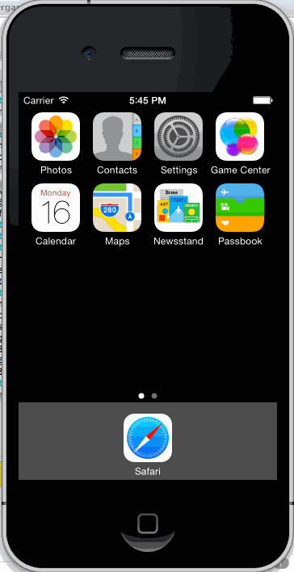

RottenTomatoesApp
# Rotten Tomatoes Homework
# Number of hours spent: 7
# Completed stories
    # User can view a list of movies from Rotten Tomatoes.  Poster images must be loading asynchronously.
    # User can view movie details by tapping on a cell
    # User sees loading state while waiting for movies API.  You can use one of the 3rd party libraries here.
    # User can pull to refresh the movie list.
    # All images fade in (optional)
# Used cocoapods and AFNetworking
# Used MBProgressHUD for the progress notification
# I ran out of time and didn't display the network error
# GIF of working app (sorry it's ugly, next week will be better!)

